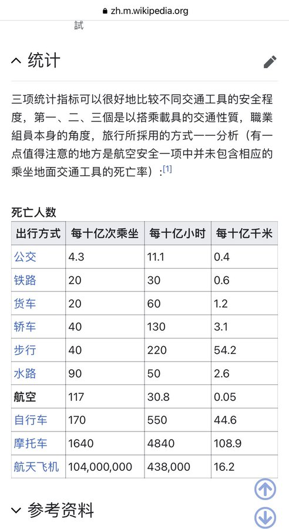

- DONE 今天搞完 SR 会议 PPT
  collapsed:: true
  :LOGBOOK:
  CLOCK: [2022-03-23 Wed 10:01:48]
  CLOCK: [2022-03-23 Wed 10:02:32]
  CLOCK: [2022-03-23 Wed 10:03:28]--[2022-03-23 Wed 22:10:21] =>  12:06:53
  :END:
	- 🏳‍🌈 **库存管理部分**
		- DOS 概况与产品动销
		- ❗ 货品分仓调整
	- 🏴‍☠️ **供应管理部分**
		- 常规产品送货准时率与供应商库存（VMI & 供应商库存变化）
		- ❗ 新品供货及动销情况（直播后调整？）
	- 🏴 **特殊议题：一盘货部分**
		- 😊 取得的成果
			- 减少繁杂的人工单据--仓库、采购（去系统里拉单据数做对比：一月 vs 三月）
			- 高效利用库存--分销镜光问题（找到二月月结时分销哪些东西出超了，超了多少，填完之后最终 DOS 情况）
			- 优化ERP审单流程--减少系统二次判断（之前产生的因为虚拟仓造成的判断性能问题得到解决）
			- 让更多的货被渠道看到利用到，减少私自囤积，货品积压（哆啦化妆套刷 & 看库存流程培训）
				- 让库存分配更安心（在仓里的就是我的，直播的放在公共仓就不会有人偷偷消耗，从系统层面卡死以前出现的问题）
		- 🌞 产品领用（三月领用记录 & 后续管控方案）
		- 🌚 在仓库存低的时候会产生的问题
			- 新品在途分配（目前困扰 --> **提前分配**）
			- 低库存产品（目前困扰 & PLM 管理 --> **集中度**：是否需移仓？& 是否需划给渠道？）
- NOW 编写 SP 组指引手册提上日程
  collapsed:: true
  :LOGBOOK:
  CLOCK: [2022-03-23 Wed 10:03:53]
  CLOCK: [2022-03-23 Wed 10:04:05]
  :END:
	- 供应管理（订单管理系统）
		- 下单跟进表
		- 送货计划表
		- 采购到货表
		- 实际到货表
	- 库存管理
		- 库存效期表
		- 一盘货系统
- DONE [Web3 学习宝藏](https://www.alexdphan.com/research/library-of-web3)！
	- 再议，暂时没兴趣~~
- #Quotes @Mier: 转专业的有转专业的问题，科班生有科班生的问题，知识分子家孩子有自己的问题，穷人家孩子也有自己的问题，不同的人克服了不同的困难走到了同一步，接下来大家面对浩瀚的自然世界又会遇到全新的问题，旧方法已经没用了。能尽早适应的就能尽早做出好的工作，适应不了的又改变不了心态的，或许会出问题。
- #random-thought 关于交通方式的死亡率，平时说的飞机最低都是在说按**里程**来算，其实还有其他维度，可能会有点儿不一样的发现。
  collapsed:: true
	- 
- LATER 学点新东西 —— 如果你有一些基本的UML经验，推荐 @PenngXiao 做的 [ZenUML](https://www.zenuml.com/)，简单学习之后果然还是觉得「写」UML 比「画」要更优雅。
	- 画这玩意会消耗相当多的精力在排版布局/美感上，功能齐全推荐 [Mermaid](https://mermaid-js.github.io/mermaid/#/) ，类似 Markdown 的效果，实现用文本画各种流程图。
- LATER 看到推上有人参加了 [实习急救员](https://houjoe.notion.site/d536f4220669479daeb73d79e6f1399e) 的培训，我也想花一天时间去培训一下！哪天叫上小伙伴一起去啦！
- 跟着北叔看 #吃啥 之「[撸串烧烤](https://twitter.com/BianTaiNorth/status/1504808309970259968?s=20&t=d_jBwIaJ0Mk5KY_jfiFEzw)」
  collapsed:: true
	- 一醉解千愁，一烧泯恩仇。
	  id:: 623b3ae8-1171-43f1-b729-442778a24d7f
	  collapsed:: true
	  与名震天下的东北烧烤对比，广式撸串仿如小家碧玉般偏安一隅。其最大特点是相对内敛，正统是不用辣椒孜然，更多使用蜜汁，出品偏清口多汁。**老王、大档和风筒辉**就是其中的代表，而后者多擅海鲜。追求高阶食材可以去**1218**，侧重品质出品。五花八门，人间食客追个鲜字总不会错吧
		- {:height 918, :width 683}
- #Quotes @发條橙子：永遠記得她描述我們未來時那雙閃閃發亮的眼睛。
- NOW [Pandas, Tidyverse, SQL 对比学习](https://pandas.pydata.org/docs/getting_started/comparison/comparison_with_r.html)，上班摸鱼专用，背下来，背下来，一定背下来！ #study
  :LOGBOOK:
  CLOCK: [2022-03-23 Wed 23:34:00]
  CLOCK: [2022-03-23 Wed 23:34:06]
  :END:
	- 感觉他写的好乱啊，还是得自己来
- NOW 学习一个 R 包 —— [modelStudio](https://www.business-science.io/r/2022/02/22/my-4-most-important-explainable-ai-visualizations-modelstudio.html?utm_content=bufferb31e4&utm_medium=social&utm_source=twitter.com&utm_campaign=buffer)，用来生成做模型解释的四个图形 #study
  :LOGBOOK:
  CLOCK: [2022-03-23 Wed 23:39:27]
  CLOCK: [2022-03-23 Wed 23:39:29]
  :END:
	- @Matt Dancho (Business Science): 
	  Machine learning is great, until you have to explain it. Don't worry. This R package will save you.