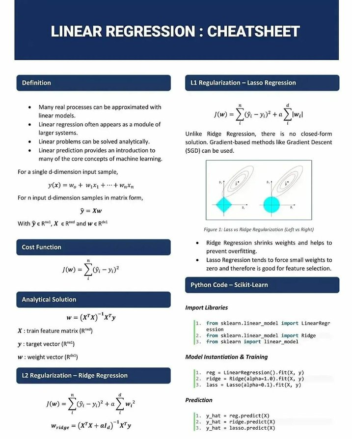

- NOW #study [《Git基本原理系列视频》](https://space.bilibili.com/364122352/channel/collectiondetail?sid=290009)，这个教程真不错，这周茶余饭后跟着他好好学一下 Git 吧！
  :LOGBOOK:
  CLOCK: [2022-03-27 Sun 19:48:01]
  :END:
- #Quotes @变态小马 哒哒哒：我这两天一直精神状态不是很好。很少做梦的我狠狠地做了两个噩梦。下午我妈给我打电话问我怎么还在睡觉，新工作辛不辛苦。我说就那样吧，我妈说：你这样太辛苦了，应该早点找个好的归宿。我敷衍了一下就挂电话了。什么是归宿，这世间哪有好的归宿。潦草糊涂的一生是大多数人的一生。我也不能幸免。
  collapsed:: true
	- @hikerly: 越是状态不好，越不要寄予婚姻。
	- @好谈国是：中文太含蓄了，归宿不就是结婚成家吗，难道还能是自主创业当老板？或者是还能是躺平啃老？宿字带有宿命，无法摆脱的意思，亦即人终极追求就是结婚繁衍而已，不守这条诫命的都被淘汰了，这在丛林社会中是一条铁律，你母亲很清醒。
		- @好谈国是：当然我还没有分析归宿这个词中所含有的“平淡安稳”那层意思，这显然意味着不找归宿的生活必然是要人颠沛流离吃尽苦头的。
- LATER #Quotes #study 可以仿照这种形式学习算法来着 ML - Linear Regression Cheatsheet {:height 837, :width 677}
- NOW 开写本周周报，争取两小时解决战斗！
  SCHEDULED: <2022-03-27 Sun 21:09>
  :LOGBOOK:
  CLOCK: [2022-03-27 Sun 20:07:51]
  CLOCK: [2022-03-27 Sun 22:07:55]
  :END:
-