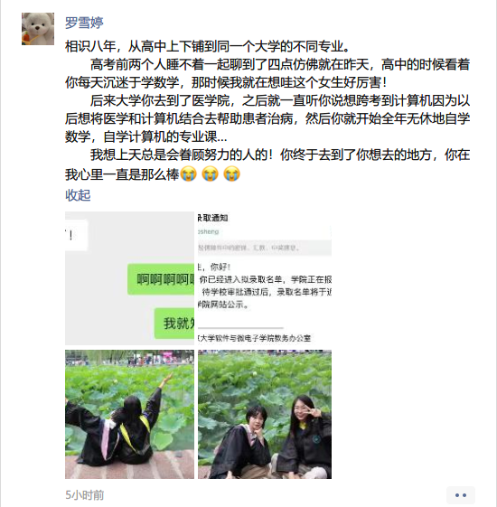

- 今日聚焦（5h）
  background-color:: #264c9b
  SCHEDULED: <2022-03-31 Thu 15:00>
  DEADLINE: <2022-03-31 Thu 19:30>
	- 下午（1h）
	  background-color:: #49767b
		- DONE 去跑步， 跑大学城中环，run，run，run！🏃‍
		  :LOGBOOK:
		  CLOCK: [2022-03-31 Thu 17:57:25]--[2022-03-31 Thu 21:41:32] =>  03:44:07
		  :END:
	- 晚上（4h）
	  background-color:: #49767b
		- DONE 完成 R-showtext 博文 📃
		  :LOGBOOK:
		  CLOCK: [2022-03-31 Thu 21:42:47]--[2022-04-01 Fri 11:15:19] =>  13:32:32
		  :END:
- 今日奖赏（30min）
  background-color:: #497d46
  DEADLINE: <2022-03-31 Thu 23:59>
  SCHEDULED: <2022-03-31 Thu 23:30>
	- 脱毛，搞起！
	- 刷手机记录美言美语
	- 回复微信消息，没有当我没说
	- 洗澡 --> 打开 Youtube 英文视频 --> 入眠
- #random-thought 真心为之前的同学开心☺，愿所有的追梦人都能有个好归宿！
	- {:height 400, :width 443}
	- 陈妍媛
	- 还有怎么感觉高中同学们都好厉害吖！爱了爱了，大家快乐幸福！
- #Quotes @oolongSH: 我的想法很简单，不要把希望寄托在除了自己以外的人身上，那些都只是止痛药罢了。一旦依赖上了，失去了只会更痛苦。
- #DPMB 听我一句劝，别等我，真的。真的，不值得。
- #Quotes @paemulcookie: 时间就像沙子，会从指缝溜走。自从用 WakaTime 记录自己的工作时间，然后看着排行榜前列的工作时间，我知道我的各种想法之所以没有实现，并不是因为我的工作太忙，是我不够努力。